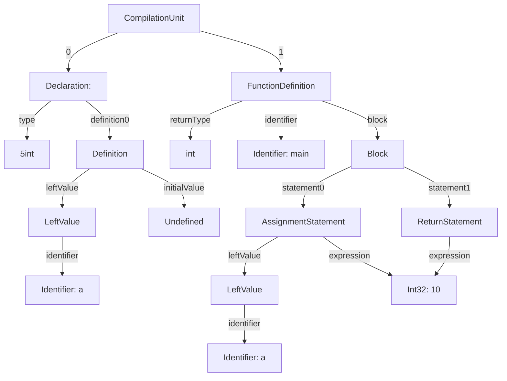

```mermaid
graph TD
17[CompilationUnit]
17--0-->4
4[Declaration:]
4--type-->5int
4--definition0-->2
2[Definition]
2--leftValue-->1
1[LeftValue]
1--identifier-->0
0[Identifier: a]
2--initialValue-->3
3[Undefined]
17--1-->15
15[FunctionDefinition]
15--returnType-->16[int]
15--identifier-->6
6[Identifier: main]
15--block-->14
14[Block]
14--statement0-->10
10[AssignmentStatement]
10--leftValue-->8
8[LeftValue]
8--identifier-->7
7[Identifier: a]
10--expression-->9
9[Int32: 10]
14--statement1-->13
13[ReturnStatement]
13--expression-->9
9[Int32: 10]
```
