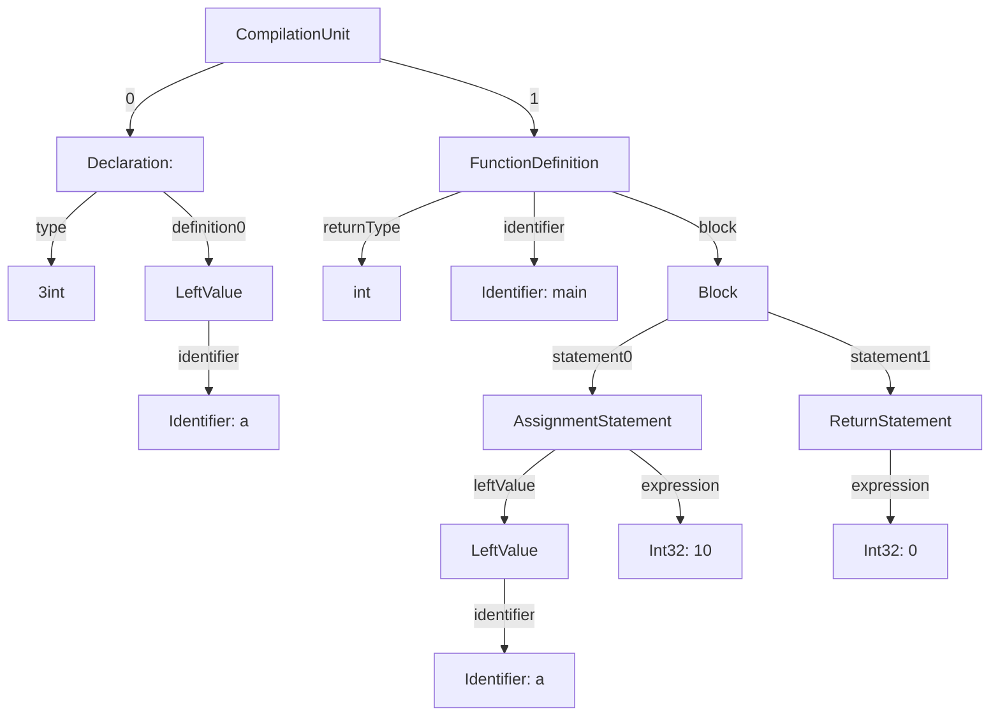

```mermaid
graph TD
14[CompilationUnit]
14--0-->2
2[Declaration:]
2--type-->3int
2--definition0-->1
1[LeftValue]
1--identifier-->0
0[Identifier: a]
14--1-->12
12[FunctionDefinition]
12--returnType-->13[int]
12--identifier-->4
4[Identifier: main]
12--block-->11
11[Block]
11--statement0-->8
8[AssignmentStatement]
8--leftValue-->6
6[LeftValue]
6--identifier-->5
5[Identifier: a]
8--expression-->7
7[Int32: 10]
11--statement1-->10
10[ReturnStatement]
10--expression-->9
9[Int32: 0]
```
